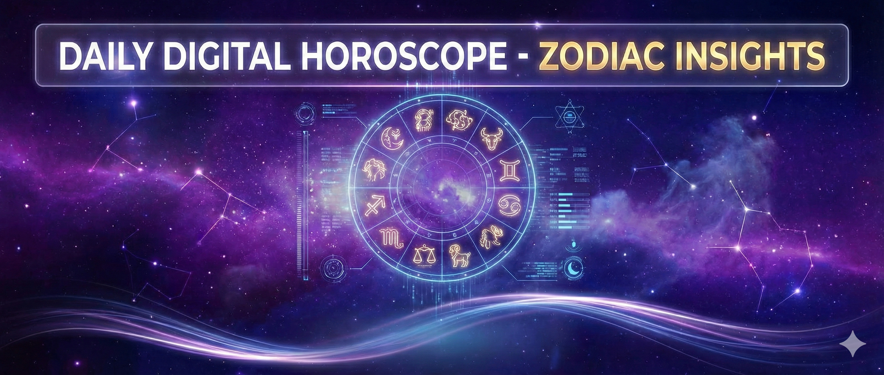
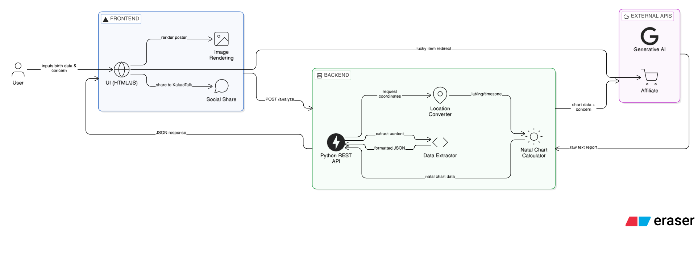

# ✨ Star Sync : AI 점성학 운세 & 천궁도 분석 서비스

**AI와 점성학 데이터가 결합된 나만의 우주 천궁도 및 2026 인생 전략 리포트**

[🚀 서비스 바로가기 (https://daily-star-sync.vercel.app)](https://daily-star-sync.vercel.app)

---

## 📌 1. 프로젝트 소개 (Introduction)
전통적인 점성학(Astrology)의 천궁도(Natal Chart) 계산 로직에 **생성형 AI(Google Gemini)** 를 결합하여, 사용자의 생년월일시와 위치 정보를 기반으로 개인화된 인생 전략과 운세를 제공하는 풀스택 웹 서비스입니다. 

기존의 정적인 텍스트 운세에서 벗어나, 동적인 우주 UI와 SNS 공유에 최적화된 결과 포스터를 제공하여 사용자 경험(UX)과 바이럴 루프(Viral Loop)를 극대화했습니다.

 

## 🎬 2. 서비스 데모 (Demo)

  <video src="https://github.com/user-attachments/assets/26c6929d-1596-4a4c-af7e-248dda150f79" 
         width="80%" 
         controls 
         autoplay 
         muted 
         loop>
  </video>

 

## ⚙️ 3. 시스템 아키텍처 (Architecture)

  

- **Client Request:** 사용자가 생년월일/고민 입력 ➔ Frontend에서 검증 후 Backend(FastAPI)로 데이터 전송
- **Data Processing:** Backend에서 `Geopy`로 좌표 변환 ➔ `Kerykeion`으로 행성 위치 데이터(Chart Data) 연산
- **AI Interpretation:** 계산된 차트 데이터와 고민 내용을 조합하여 `Gemini API`에 전송 (프롬프트 제어)
- **Parsing & Response:** AI의 자연어 응답을 정규표현식(Regex)으로 파싱하여 Keyword와 Report 본문 분리 ➔ Frontend로 JSON 응답
- **Rendering:** Frontend에서 동적 UI 생성 및 `html2canvas`로 공유용 카드 이미지 렌더링

 

## 🚀 4. 핵심 기능 (Key Features)

| 기능 | 설명 | 기술 |
|:---:|---|:---:|
| **정밀 천궁도 계산** | Geopy를 통한 정확한 위경도/타임존 추출 후 Kerykeion 라이브러리로 행성 배치 계산 | Python, Geopy, Kerykeion |
| **AI 맞춤형 운세** | Gemini API 프롬프트 엔지니어링을 통해 '키워드, 테마, 점수' 등 정형화된 JSON 응답 추출 | Gemini 3.0 Flash, Prompt Engineering |
| **결과 카드 캡처** | `html2canvas`를 활용해 분석 결과를 인스타그램/카카오톡 공유에 최적화된 포스터(1200x1600)로 렌더링 | html2canvas, Vanilla JS |
| **수익화 연동 (BM)** | 럭키 아이템을 쿠팡 파트너스 트래킹 링크와 자동 연결하여 제휴 마케팅 수익 창출 지원 | Coupang Partners API (Linking Logic) |

 

## 💡 5. 핵심 트러블슈팅 (Troubleshooting)

<b>1. AI의 비정형 텍스트에서 정확한 '키워드' 파싱 (Prompt & Regex)</b>

- **문제:** AI에게 사용자의 고민을 전달했을 때, 해시태그용 키워드만 추출해야 하나 불필요한 서술어나 특수기호가 섞여 출력되는 포맷 불안정성 발생.
- **해결:** 시스템 프롬프트(f-string)를 개선하여 무조건 첫 줄에 `[키워드] OO운` 형태로 출력하도록 강제함. 이후 파이썬의 **정규표현식(`re.search`)** 을 사용해 빈 줄이나 특수기호가 섞이더라도 정확하게 키워드 그룹만 파싱하여 프론트엔드로 전달하는 로직 구현.

<b>2. html2canvas 캡처 시 레이아웃 붕괴 현상 해결</b>

- **문제:** 웹 브라우저 화면에서는 정상적으로 렌더링되는 UI가, 이미지 캡처 시 여백(Margin)이 무시되거나 내부 요소가 캔버스 밖으로 밀려나는 렌더링 버그 발생.
- **해결:** 웹용 CSS와 캡처 카드용 CSS 공간을 완전 분리. `.share-card` 하위 선택자에만 적용되는 캡처 전용 `!important` 값들을 별도 지정하고, 캔버스가 인식하는 상하단 공백을 강제 조정하여 1200x1600 비율의 완벽한 캡처 퀄리티 확보.

<b>3. 쿠팡 파트너스 수익 트래킹 누락(API 리다이렉트) 이슈 우회</b>

- **문제:** 동적 검색어 주소로 제휴 링크를 구성했으나, 쿠팡 보안 정책상 정상 발급된 단축 링크가 아니면 클릭/수익 트래킹이 유실되고 메인 홈으로 튕기는 현상 발견.
- **해결:** 15만 원 매출 달성 전까지 파트너스 API 사용이 불가한 딜레마를 해결하기 위해, 공식 간편 링크 기반의 라우팅 구조로 즉시 수정. 버튼 텍스트를 직관적으로 변경(`(쿠팡에서 검색)`)하여 UX를 해치지 않으면서도 클릭수 100% 집계가 정상 작동하도록 로직 우회 적용.

 

## 🎓 6. 회고 및 배운 점 (Learnings)
- AI에게 단순히 좋은 대답을 요구하는 것을 넘어, 시스템이 파싱할 수 있는 **'엄격한 포맷(JSON, 특수기호 규칙)'** 을 강제하고, 이를 정규식으로 안전하게 추출해 내는 파이프라인 설계 역량을 길렀습니다.
- 단순한 프론트엔드/백엔드 연동을 넘어, 외부 API(Google Gemini, Kakao SDK, Coupang Partners)들의 **각기 다른 정책과 응답 형식을 능동적으로 핸들링하는 능력**을 길렀습니다.
- 서비스 배포 후 **Google Analytics 연결 및 SEO 메타 태그(Open Graph) 최적화**를 통해, 단순히 '기능 구현'에서 끝나는 것이 아니라 '실제 유저를 유입시키고 운영하는 관점'을 배우게 되었습니다.

---
*개발 기간: 2026.01 ~ 2026.02 | 1인 개인 프로젝트*
